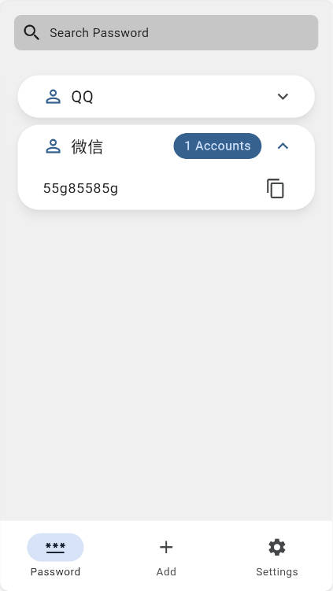
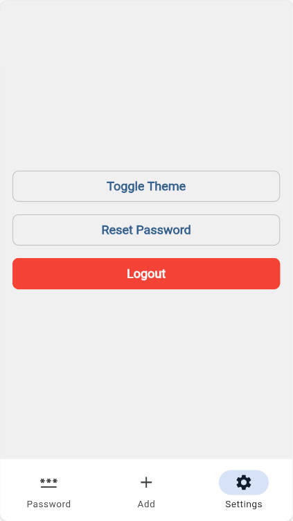
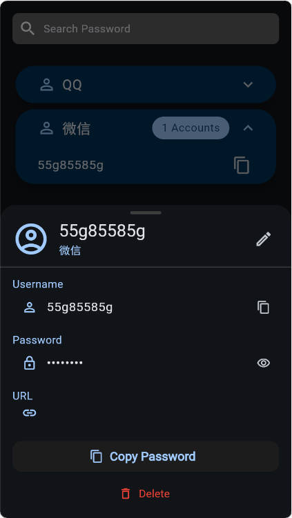

# SilentKey

一个简单的本地密码管理器。

## 依赖插件

| 插件 | 用途 |
|------|------|
| get | 状态管理、路由 |
| bot_toast | 提示信息 |
| hive / hive_flutter | 本地数据库 |
| encrypt | AES 加密 |
| shared_preferences | 偏好设置 |

## 加解密方式

- **算法**: AES-256-CBC
- **密钥派生**: PBKDF2 (SHA-256)
- **数据存储**: 加密后 base64 编码存入本地数据库

## 支持功能

- 6位数字主密码登录（支持键盘输入）
- 账号密码存储与管理
- 密码分类
- 深色/浅色主题切换
- 修改主密码
- 退出登录

## 项目截图
|  |   |  |
| --------------------------------------- | --------------------------------------- | -------------------------------------- |
|  |  |                                        |


## 运行

```bash
flutter pub get
flutter run
```
